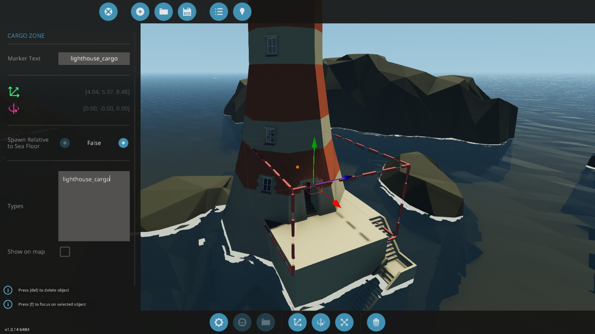

# Tutorial

## 例1. 研究センターの消火&救助ミッション

火災が発生した研究センターに向かい、火災を消火・生存者を救助するミッションを作成する。

1. ゲーム画面でメニューを開き、「Mission Editor」を起動する
2. 上メニューの「New Mission Playlist」から新規ミッションプレイリストを作成する
3. Location -> Add Unique Locationからミッションが起きる場所を選択する（今回はSCIENCE）\
追加後、テキストボックスに`rescue_lab`と入力しておく

4. 「Edit objects」でエディット画面に入り、Fire（火災）やCharacter（要救助者）、Vehicle（乗り物）などを設置する

5. 「Add Zone」で最初に向かわせる地点を指定する。（範囲はここではなく後ほど設定する）\
Tagとして任意の名前を付ける（今回は`zone_lab`）

6. 上メニュー「Playlist overview」で戻ってミッション名横の「Edit playlist lua」をクリックする
7. [script.lua](/script.lua)の内容をコピーし、以下のように`mm_missions`と`pack_name`の内容を書き換える（[リファレンス](/doc/Refernce_JP.md)も参照）
```lua
local pack_name = "mypack" 
```
```lua
local mm_missions = {
	rescue_fire = {
		title = "Rescue scientist",
		location = "rescue_lab",
		base_reward = 5000,
		base_research = 10, 
		probability = 0.5,
		tasks = {
			{
				step = 0,
				type = "goto_zone",
				zone = "zone_lab",
				zone_size = 150,
				name = "Respond to emergency call",
				desc = "Investigate emergency call from lab.",
				timelimit = 60*60*60
			},
			{
				step = 1,
				type = "extinguish",
				name = "Extinguish fire",
				desc = "Extinguish the fires.",
				timelimit = 60*60*60
			 },
			 {
				step = 1,
				type = "rescue",
				name = "Rescue 3 survivor",
				desc = "Deliver survivor to hospital.",
				timelimit = 60*60*45,
			 }
		}
	}
}

```

<details><summary>コード解説</summary><div>

```lua
local mm_missions = {
	rescue_fire = {
		title = "Rescue scientist", -- ミッション名
		location = "rescue_lab",    -- Step3で指定したLocation
		base_reward = 5000, --報酬
		base_research = 10, 
		probability = 0.5,  -- 発生確率
		tasks = {
			{
				-- 指定したゾーン(zone_lab)に移動する。
				step = 0, -- 最初のステップ
				type = "goto_zone",   -- 「ゾーンに移動する」というタスク
				zone = "zone_lab", -- Step5で指定したゾーン名
				zone_size = 150,      -- ゾーン半径
				name = "Respond to emergency call", -- タイトル
				desc = "Investigate emergency call from lab.", -- 説明
				timelimit = 60*60*60 -- 制限時間(tick) 60*60*60=1時間
			},
			{
				-- 火災を消火する。デフォルトではlocation内すべてのfireが対象
				step = 1, -- 2つめのステップ。前のステップが終わるまでは表示されない
				type = "extinguish",
				name = "Extinguish fire",
				desc = "Extinguish the fires.",
				timelimit = 60*60*60
			 },
			 {
				-- 生存者を救助する。デフォルトではlocation内すべてのcharacterが対象
				step = 1, -- 同じstepが複数ある場合、同時に表示される
				type = "rescue",
				name = "Rescue 3 survivor",
				desc = "Deliver survivor to hospital.",
				timelimit = 60*60*45,
			 }
		}
	}
}
```

</div></details>

8. 保存して新規セーブを作成し、Addonとしてこのデータを選択する
9. チャットを開き、`?spawn mypack rescue_fire`でミッションを開始してテストする
10. 問題なければスクリプトの`debug = true`を`false`に変更して公開する

## 例2. 灯台への箱運搬ミッション

Outpost Beginner(初期拠点)から灯台に段ボール箱を運搬するミッションを作成する。

1. ゲーム画面でメニューを開き、「Mission Editor」を起動する
2. 上メニューの「New Mission Playlist」から新規ミッションプレイリストを作成する
3. Location -> Add Unique Locationから箱を配置する場所を選択する（今回はSTARTER BASE）\
追加後、テキストボックスに`deliver_lighthouse`と入力しておく
4. 「Edit objects」でエディット画面に入り、Objectから箱2つとパレットを配置する
5. 箱のみを配送対象にしたいので、この2つの箱にMarker textに`target`を指定しておく

6. 上メニュー「Playlist overview」で戻って、ENVIRONMENT MOD -> Select a location to modから配送先の場所を選択する（今回はLIGHTHOUSE）

7. エディット画面に入り、Cargo zoneで配送先エリアの位置、大きさを設定する\
Typesに`lighthouse_cargo`を指定し、marker textにも入力しておく **（指定はTypesで行うが、両方指定しないと認識されないので注意）**

8. 戻ってミッション名横の「Edit playlist lua」をクリックする
9. [script.lua](/script.lua)の内容をコピーし、以下のように`mm_missions`と`pack_name`の内容を書き換える（[リファレンス](/doc/Refernce_JP.md)も参照）
```lua
local pack_name = "mypack" 
```
```lua
local mm_missions = {
	deliver_object = {
		title = "Deliver equipment to lighthouse",
		location = "deliver_lighthouse",
		base_reward = 5000,
		base_research = 10, 
		probability = 0.5,
		tasks = {
			{
				step = 0,
				type = "deliver_object",
				name = "Deliver equipment",
				desc = "Deliver equipment to lighthouse.",
				delivery_name = "target",
				delivery_zone = "lighthouse_cargo",
				timelimit = 60*60*60,
			}
		},
	}
}

```

<details><summary>コード解説</summary><div>

```lua
local mm_missions = {
	deliver_object = {
		title = "Deliver equipment to lighthouse", -- ミッション名
		location = "deliver_lighthouse", -- Step3で指定したLocation
		base_reward = 5000, --報酬(現金)
		base_research = 10, --報酬(リサーチポイント)
		probability = 0.5,-- 発生確率
		tasks = {
			{
				-- 指定したCargo zone(zone_lab)に配達する。
				step = 0,-- 最初のステップ
				type = "deliver_object",-- 「ゾーンに移動する」というタスク
				name = "Deliver equipment", -- タイトル
				desc = "Deliver equipment to lighthouse.",-- 説明
				delivery_name = "target", -- Step5で指定した配送対象のMarker text
				delivery_zone = "lighthouse_cargo",  -- Step7で指定した配送先のCargo zoneのTypes
				timelimit = 60*60*60, -- 制限時間(tick) 60*60*60=1時間
			}
		},
	}
}
```

</div></details>

8. 保存して新規セーブを作成し、Addonとしてこのデータを選択する
9. チャットを開き、`?spawn mypack deliver_object`でミッションを開始してテストする
10. 問題なければスクリプトの`debug = true`を`false`に変更して公開する